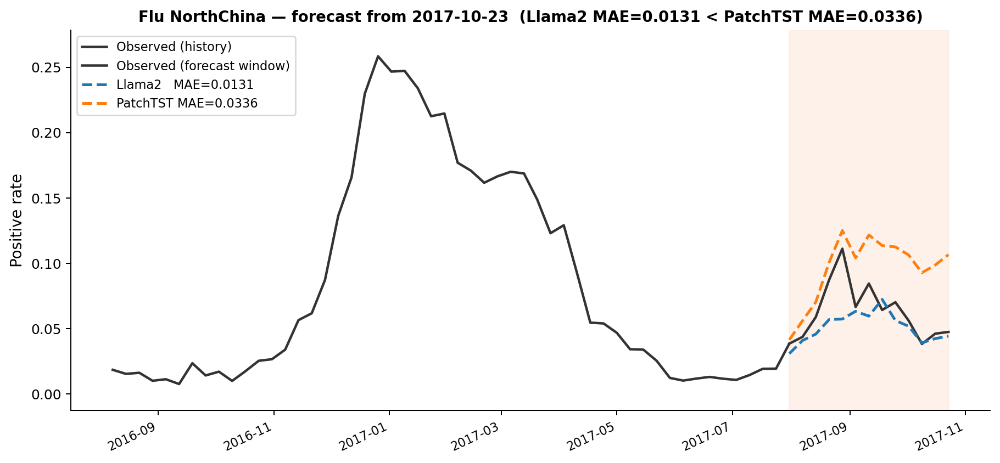

# LLMs4Influenza

This repository provides the implementation accompanying the protocol paper:

> **Protocol for fine-tuning frozen large language models to forecast influenza-like illness from weekly surveillance time series**

The protocol is based on the original research paper:

> **Fine-tuned large language models enhances influenza forecasting**

The original codebase is available at: https://github.com/licx11/LLMs4Influenza.git

---

## Overview

This protocol describes a step-by-step procedure for adapting pre-trained large language models (LLMs) — with frozen backbone weights — to the task of forecasting influenza-like illness (ILI) incidence from weekly epidemiological surveillance time series. By keeping the LLM backbone frozen and only training lightweight adapter layers, the method achieves strong forecasting performance while substantially reducing computational cost.

---

## Requirements

- Python >= 3.8
- PyTorch 1.8.1
- transformers
- einops
- tqdm
- matplotlib

Install dependencies:

```bash
pip install -r requirements.txt
```

---

## Data

Download the ILI surveillance dataset from:

> https://www.nature.com/articles/s41467-021-23440-1

Place the data files under `./dataset/`.

---

## Pre-trained Models

This codebase supports multiple LLM backbones. Download the desired pre-trained model and specify its local path via `--gpt_path` at runtime:

| Model | Source |
|-------|--------|
| GPT-2 | [HuggingFace: openai-community/gpt2](https://huggingface.co/openai-community/gpt2) |
| LLaMA-2 | [HuggingFace: meta-llama/Llama-2-7b-hf](https://huggingface.co/meta-llama/Llama-2-7b-hf) |
| LLaMA-3 | [HuggingFace: meta-llama/Meta-Llama-3-8B](https://huggingface.co/meta-llama/Meta-Llama-3-8B) |
| Gemma-2 | [HuggingFace: google/gemma-2-2b](https://huggingface.co/google/gemma-2-2b) |

---

## Usage

### Generate Comparison Plot

To generate a comparison plot between Llama2 and PatchTST models for date 2017-10-23:

```bash
bash scripts/run_single_comparison_2017-10-23.sh
```

This script will:
1. Train Llama2 model for the specified date with 3 iterations
2. Train PatchTST model for the same date with 3 iterations
3. Generate a comparison figure showing both predictions

The output figure will be saved to `./figures/2017-10-23.png`:



### Basic Training

Run training with:

```bash
python main.py \
  --model_id <experiment_name> \
  --model Llama2 \
  --gpt_path <path_to_llama2_model> \
  --data_path <your_data.csv> \
  --seq_len 52 \
  --pred_len 13 \
  --batch_size 4 \
  --train_epochs 64 \
  --learning_rate 1e-4 \
  --d_model 4096 \
  --llama_layers 32 \
  --is_gpt 1
```

Key arguments:

| Argument | Description |
|----------|-------------|
| `--model_id` | Experiment identifier (required) |
| `--gpt_path` | Path to the local pre-trained model directory (required) |
| `--model` | Model architecture: `GPT4TS`, `Llama2`, `Llama3`, `Gemma2`, `PatchTST`, `DLinear` |
| `--pretrain` | Use pre-trained weights (`1`) or train from scratch (`0`) |
| `--freeze` | Freeze backbone parameters (`1`) or fine-tune all (`0`) |
| `--seq_len` | Input sequence length |
| `--pred_len` | Forecast horizon |

Example scripts are provided in `./scripts/`.

---

## Hardware

Experiments were conducted on a single NVIDIA Tesla T4 GPU. Mixed-precision training (`torch.cuda.amp`) is enabled by default to reduce memory usage.

---

## Repository Structure

```
LLMs4Influenza/
├── dataset/              # Surveillance time series data
├── models/               # Model architectures (GPT4TS, Llama2, Llama3, Gemma2, ...)
├── data_provider/        # Data loading and preprocessing
├── utils/                # Training utilities (early stopping, metrics, visualization)
├── scripts/              # Example training scripts
├── checkpoints/          # Saved model checkpoints
└── main.py               # Training entry point
```

---

## Acknowledgements

We gratefully acknowledge the following repositories:

- https://github.com/licx11/LLMs4Influenza.git — original implementation
- https://github.com/thuml/Time-Series-Library
- https://github.com/DAMO-DI-ML/NeurIPS2023-One-Fits-All
